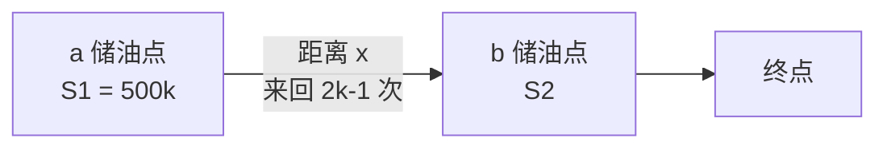
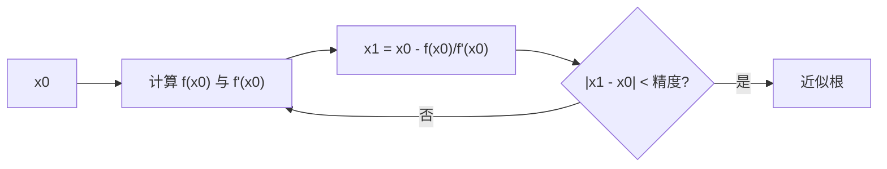

# 迭代算法

算法设计与分析  
第 4 章：基本的算法策略

---
layout: default
---

# 第 4 章内容提要

- 4.1 迭代算法
- 4.2 蛮力法
- 4.3 分而治之算法
- 4.4 贪婪算法
- 4.5 动态规划
- 4.6 算法策略间的比较

---
layout: default
---

# 4.1 迭代算法

基本思想：**用旧值计算新值**，常用于数值计算。

常见迭代策略：

- 累加
- 累乘

基本步骤：

1. 确定迭代模型
2. 建立迭代关系式
3. 对迭代过程进行控制

停止方式：

- 固定次数结束
- 满足特定条件结束

---
layout: default
---

# 4.1.1 递推法：兔子繁殖问题

一对兔子从出生后第三个月开始，每月生一对小兔子。小兔子到第三个月又开始生下一代小兔子。若兔子只生不死，一月份抱来一对刚出生的小兔子，问一年中每个月各有多少只兔子。

月份与数量：

| 月份 | 1月 | 2月 | 3月 | 4月 | 5月 |
|---|---:|---:|---:|---:|---:|
| 数量 | 1 | 1 | 2 | 3 | 5 |

数学模型：

$$
y_1 = y_2 = 1,\quad y_n = y_{n-1} + y_{n-2},\ n = 3,4,\ldots
$$

数据结构：

- 使用数组存储 $y_n$
- 使用变量存储 $y_n$

---
layout: two-cols
---

# 递推算法 1

递推关系：

$$
y_n = y_{n-1} + y_{n-2}
$$

变量含义：

- `a`：前 2 个月的数量
- `b`：前 1 个月的数量
- `c`：当前数量

循环不变式：

$$
c = a + b
$$

::right::

```c
main()
{
  int i, a = 1, b = 1, c;
  print(a, b);

  for (i = 1; i <= 10; i++) {
    c = a + b;
    print(c);
    a = b;
    b = c;
  }
}
```

```text
更新顺序：c <- a + b, a <- b, b <- c
```

---
layout: two-cols
---

# 递推算法 2

一次循环递推 3 步。

循环“不变式”：

$$
c = a + b,\quad a = b + c,\quad b = a + c
$$

递推迭代表达式：

| 步 | 1 | 2 | 3 | 4 | 5 | 6 | 7 | 8 |
|---|---|---|---|---|---|---|---|---|
| 变量 | a | b | c=a+b | a=b+c | b=a+c | c=a+b | a=b+c | b=a+c |

::right::

```c
main()
{
  int i, a = 1, b = 1, c;
  print(a, b);

  for (i = 1; i <= 4; i++) {
    c = a + b;
    a = b + c;
    b = c + a;
    print(a, b, c);
  }
}
```

```text
一轮循环：c <- a+b -> a <- b+c -> b <- c+a
```

---
layout: two-cols
---

# 递推算法 3

一次循环递推 2 步。

循环“不变式”：

$$
a = a + b,\quad b = a + b
$$

递推迭代表达式：

| 步 | 1 | 2 | 3 | 4 | 5 | 6 |
|---|---|---|---|---|---|---|
| 变量 | a | b | a=a+b | b=a+b | a=a+b | b=a+b |

::right::

```c
main()
{
  int i, a = 1, b = 1;
  print(a, b);

  for (i = 1; i <= 5; i++) {
    a = a + b;
    b = a + b;
    print(a, b);
  }
}
```

```text
一轮循环：a <- a+b -> b <- a+b
```

---
layout: default
---

# 递推法：最大公约数

例：求两个整数的最大公约数。

算法设计思路：

1. 短除法
2. 辗转相除法，也称欧几里得算法

核心递推关系：

$$
\gcd(m,n) = \gcd(n, m \bmod n)
$$

---
layout: two-cols
---

# 欧几里得算法

递推关系：

$$
\gcd(m,n) = \gcd(n, m \bmod n)
$$

循环不变式：

```text
c = a mod b
a = b
b = c
```

::right::

```c
main()
{
  int a, b, c;
  input(a, b);

  if (b == 0) {
    print("data error");
    return;
  }

  c = a % b;
  while (c != 0) {
    a = b;
    b = c;
    c = a % b;
  }

  print(b);
}
```

```text
(a, b) -> (b, a mod b)
直到余数为 0，当前 b 即为 gcd
```

---
layout: default
class: text-center
---

# 4.1.2 倒推法

迭代法：**正推**，由前向后解问题。  
倒推法：**反推**，从后往前推解问题。

---
layout: two-cols
---

# 倒推法：猴子吃桃

一只小猴子摘了若干桃子，每天吃现有桃的一半多一个。到第 10 天时只剩 1 个桃子，求原有多少个桃？

递推数学模型：

$$
a_i = (1 + a_{i+1}) \times 2,\quad i = 9,8,7,\ldots
$$

循环不变式：

$$
a = (1 + a) \times 2
$$

::right::

```c
main()
{
  int i, s;
  s = 1;

  for (i = 9; i >= 1; i = i - 1) {
    s = (s + 1) * 2;
  }

  print(s);
}
```

```text
第 10 天：1
第 9 天：(1 + 1) * 2
...
第 1 天：持续倒推得到原始数量
```

---
layout: two-cols
---

# 倒推法：杨辉三角

例：用一维数组输出杨辉三角形。

```text
1
1 1
1 2 1
1 3 3 1
1 4 6 4 1
```

```text
从右向左更新：
A[i-1] <- A[i-1] + A[i-2]
...
A[2] <- A[2] + A[1]
```

算法设计思路：

- 一维数组 `A[1..i]` 存储第 `i` 行
- 正推法会覆盖上一行的值
- 反推法可以避免覆盖

::right::

正推错误更新：

$$
A[j] = A[j-1] + A[j],\quad j = 2,3,\ldots,i-1
$$

倒推正确更新：

$$
A[j] = A[j-1] + A[j],\quad j = i-1,i-2,\ldots,2
$$

二维递推关系：

$$
a[i][j] = a[i-1][j-1] + a[i-1][j]
$$

---
layout: two-cols
---

# 杨辉三角代码

正推会产生：

```text
1
1 1
1 2 1
1 3 4 1
1 4 8 9 1
```

倒推可以得到：

```text
1
1 1
1 2 1
1 3 3 1
1 4 6 4 1
```

::right::

```c
main()
{
  int n, i, j, a[100];
  input(n);

  print("1");
  a[1] = a[2] = 1;
  print(a[1], a[2]);

  for (i = 3; i <= n; i++) {
    a[1] = a[i] = 1;
    for (j = i - 1; j > 1; j--) {
      a[j] = a[j] + a[j - 1];
    }
    for (j = 1; j <= i; j++) {
      print(a[j]);
    }
  }
}
```

---
layout: two-cols
---

# 倒推法：穿越沙漠

用一辆吉普车穿越 1000 公里的沙漠。吉普车总装油量为 500 加仑，耗油率为 1 加仑/公里。沙漠中没有油库，必须先建立临时油库。

最省油方案：

- 每次从 `a` 点加满油出发
- `a-b` 之间来回奇数次，最后一次朝 `b` 点走
- `a` 点储油量 = `a-b` 之间耗油量 + `b` 点储油量

::right::

变量：

- `k`：从 `a` 加满油向 `b` 出发的次数
- `2k-1`：`a-b` 之间的来回次数
- `x`：`a-b` 之间距离
- `S1`：`a` 点储油量
- `S2`：`b` 点储油量

数学模型：

$$
S_1 = 500k
$$

$$
S_2 = S_1 - (2k-1)x = 500k - (2k-1)x
$$

---
layout: two-cols
---

# 沙漠问题：倒推设计

第一段：倒数第一个储油点到终点

$$
k=1,\ S_2=0,\ x=500,\ S_1=500
$$

第二段：倒数第二个储油点到倒数第一个储油点

$$
k=2,\ S_1=1000,\ x=\frac{1000-500}{2\times2-1}=\frac{500}{3}
$$

第三段：倒数第三个储油点到倒数第二个储油点

$$
k=3,\ S_1=1500,\ x=\frac{1500-1000}{3\times2-1}=\frac{500}{5}
$$

::right::



---
layout: two-cols
---

# 沙漠问题代码

程序输出：

- 储油点序号
- 储油点距离
- 储油量

::right::

```c
main()
{
  int dis, k, oil;
  dis = 500;
  k = 1;
  oil = 500;

  do {
    print(k, 1000 - dis, oil);
    k = k + 1;
    dis = dis + 500 / (2 * k - 1);
    oil = 500 * k;
  } while (dis < 1000);

  oil = 500 * (k - 1) + (1000 - dis) * (2 * k - 1);
  print(k, 0, oil);
}
```

```text
倒推记录：储油点序号、到起点距离、所需储油量
```

---
layout: default
---

# 4.1.3 迭代法解方程

基本思想：**逐步逼近**。

基本步骤：

1. 确定初值 $x_0$
2. 建立迭代关系：由 $f(x)=0$ 转换为 $x=\varphi(x)$
3. 构造数列：$x_n = \varphi(x_{n-1})$
4. 直到满足停止条件

---
layout: default
---

# 迭代法求方程组根

已知方程组解的初值：

$$
X=(x_0,x_1,\ldots,x_{n-1})
$$

迭代关系方程组：

$$
x_i=g_i(X),\quad i=0,1,\ldots,n-1
$$

其中 `w` 为解的精度。

```c
for (i = 0; i < n; i++)
  x[i] = 初始近似根;

do {
  k = k + 1;
  for (i = 0; i < n; i++) y[i] = x[i];
  for (i = 0; i < n; i++) x[i] = gi(X);
  for (i = 0; i < n; i++) c = c + fabs(y[i] - x[i]);
} while (c > w && k < maxn);

for (i = 0; i < n; i++)
  print(i, "变量的近似根是", x[i]);
```

---
layout: two-cols
---

# 牛顿迭代法求根

目标：求形如

$$
ax^3 + bx^2 + cx + d = 0
$$

的方程根。

牛顿迭代思想：

$$
f(x_0) + f'(x_0)(x-x_0) \approx 0
$$

因此：

$$
x = x_0 - \frac{f(x_0)}{f'(x_0)}
$$

::right::



---
layout: two-cols
---

# 牛顿迭代代码

示例：

$$
x^3 + 2x^2 + 3x + 4 = 0
$$

::right::

```c
main()
{
  float a, b, c, d, fx;
  print("输入系数 a,b,c,d:");
  input(a, b, c, d);
  fx = f(a, b, c, d);
  printf("方程的根为：", fx);
}

float f(float a, float b, float c, float d)
{
  float x1 = 1, x0, f0, f1;

  do {
    x0 = x1;
    f0 = ((a * x0 + b) * x0 + c) * x0 + d;
    f1 = (3 * a * x0 + 2 * b) * x0 + c;
    x1 = x0 - f0 / f1;
  } while (fabs(x1 - x0) >= 1e-4);

  return x1;
}
```

---
layout: two-cols
---

# 二分法求方程根

求解方程：

$$
\frac{x^3}{2}+2x^2-8=0
$$

在区间 $[0,1]$ 上的近似根。

前提条件：

- $f(x)$ 在区间 $[a,b]$ 上连续
- $f(a)$ 与 $f(b)$ 异号，即 $f(a)f(b)<0$

::right::

算法设计：

1. $[a_0,b_0]=[a,b]$，$c_0=(a_0+b_0)/2$
2. 若 $f(c_0)=0$，则 $c_0$ 为根
3. 若 $f(a_0)f(c_0)<0$，则 $[a_1,b_1]=[a_0,c_0]$
4. 若 $f(b_0)f(c_0)<0$，则 $[a_1,b_1]=[c_0,b_0]$
5. 当 $f(c_n)=0$，或区间 $[a_n,b_n]$ 足够小，认为找到方程根

---
layout: two-cols
---

# 二分法代码

停止条件：函数值足够接近 0。

示例方程：

$$
3x^3+4x^2+2x+8=0
$$

::right::

```c
main()
{
  float x, x1 = 0, x2 = 2, f1, f2, f;
  input(a, b);

  f1 = x1*x1*x1/2 + 2*x1*x1 - 8;
  f2 = x2*x2*x2/2 + 2*x2*x2 - 8;

  if (f1 * f2 > 0) {
    printf("No root");
    return;
  }

  do {
    x = (x1 + x2) / 2;
    f = x*x*x/2 + 2*x*x - 8;

    if (f == 0) break;
    if (f1 * f > 0.0) {
      x1 = x;
      f1 = f;
    } else {
      x2 = x;
      f2 = f;
    }
  } while (fabs(f) >= 1e-4);

  print("root=", x);
}
```

```text
每次取中点 c = (a+b)/2，
保留仍满足异号条件的一半区间。
```

---
layout: default
class: text-center
---

# 小结

迭代算法的关键是：

**模型、关系式、初值、停止条件。**

递推法适合由前向后累积状态；倒推法适合从终点反向恢复状态；方程求根则通过不断逼近获得近似解。
